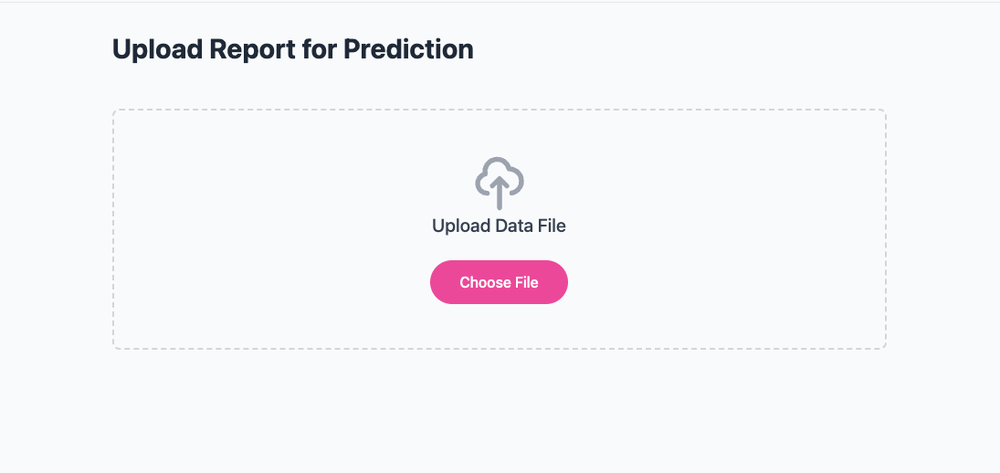

# Chest Cancer Classification System



## Project Overview
This project implements a chest cancer classification system using deep learning. The primary objective is to classify chest X-ray images into various categories like Adenocarcinoma, Large Cell Carcinoma, Normal, and Squamous Cell Carcinoma. The system uses a trained CNN model and integrates with MLflow and DVC for experiment tracking, versioning, and deployment.

## Features
- **Image Classification**: Classifies chest X-ray images into one of four categories.
- **Dynamic Frontend**: Provides a user-friendly web interface for uploading X-ray images and viewing predictions.
- **MLflow Integration**: Tracks training and evaluation experiments using MLflow.
- **DVC Integration**: Manages datasets and tracks model versions effectively.
- **Dockerized Environment**: Optional support for containerized deployment.

## Dataset
The dataset consists of chest X-ray images classified into four categories:
- Adenocarcinoma
- Large Cell Carcinoma
- Normal
- Squamous Cell Carcinoma

The dataset used in this project is sourced from [Kaggle](https://www.kaggle.com/datasets/mohamedhanyyy/chest-ctscan-images) and downloaded using the `kagglehub` library:
```python
kagglehub.dataset_download("mohamedhanyyy/chest-ctscan-images")
```

Due to its large size, the dataset is not stored directly in the repository or DagsHub. You can download it from Kaggle and set it up locally. For reproducibility, DVC is used to manage smaller artifacts and pipeline stages efficiently:
```bash
dvc pull
```
Ensure you have access to the remote storage configured in the DVC pipeline.

For experiment tracking, MLflow is integrated with DagsHub. Ensure your `.env` file contains your DagsHub credentials and tracking URI.

## Pipeline Overview
The project uses a modular pipeline implemented through notebooks and integrated with DVC. The pipeline stages include:
1. **Data Ingestion**: Fetches and preprocesses the dataset, ensuring quality and consistency.
2. **Base Model Preparation**: Defines and compiles the CNN architecture using TensorFlow.
3. **Model Training**: Trains the CNN model, performs validation, and saves the best model.
4. **Model Evaluation**: Evaluates the trained model's performance on a validation set and logs results to MLflow.

To execute the pipeline, run:
```bash
dvc repro
```
This ensures all pipeline stages are executed in the correct order with dependency tracking.

## Setup Instructions

### Prerequisites
1. Install Python 3.8 or higher.
2. Install the required dependencies:
   ```bash
   pip install -r requirements.txt
   ```
3. Configure your `.env` file with the following content:
   ```
   MLFLOW_TRACKING_URI=https://dagshub.com/<username>/chest-cancer-prediction.mlflow
   MLFLOW_TRACKING_USERNAME=<your-username>
   MLFLOW_TRACKING_PASSWORD=<your-password>
   ```
4. Install and configure DVC:
   ```bash
   pip install dvc
   dvc remote add -d <remote-name> <remote-url>
   ```

### Running the Server
1. Start the Flask server:
   ```bash
   python app.py
   ```
2. Access the web interface at `http://127.0.0.1:8080`.

### Using the Web Interface
1. Upload a chest X-ray image using the file upload section.
2. Wait for the prediction result.
3. View the classification and confidence score.

## Trained Model
The trained VGG16 model is available for download via the following link:
[Trained VGG16 Model](https://keras.io/api/applications/vgg/)

This model is based on the VGG16 architecture, a popular deep learning model for image classification. It has been fine-tuned and evaluated for high accuracy in chest cancer classification tasks using transfer learning and domain-specific optimization.

### Additional Classification Steps

- In addition to using the VGG16 model, the following steps are performed to enhance classification accuracy:

- Data Augmentation: During training, various augmentation techniques (rotation, zoom, flipping) are applied to improve the model's generalization.

- Feature Extraction: Leveraging pre-trained weights from the VGG16 model trained on ImageNet, the feature extraction layers are fine-tuned for the chest X-ray dataset.

- Fine-Tuning: The final dense layers of the VGG16 model are replaced with task-specific layers to optimize classification performance.

- Class Balancing: Addressing class imbalance in the dataset by using techniques like oversampling minority classes or weighted loss functions.

- Threshold Tuning: Adjusting classification thresholds based on confidence scores to minimize false positives and false negatives.

- Post-Processing: Combining VGG16 predictions with domain-specific rules to refine results.

### Additional Classification Steps
In addition to using the CNN model, the following steps are performed to enhance classification accuracy:
1. **Data Augmentation**: During training, various augmentation techniques (rotation, zoom, flipping) are applied to improve the model's generalization.
2. **Transfer Learning**: Pre-trained models such as VGG16 or ResNet are fine-tuned on the dataset to leverage their feature extraction capabilities.
3. **Class Balancing**: Addressing class imbalance in the dataset by using techniques like oversampling minority classes or weighted loss functions.
4. **Threshold Tuning**: Adjusting classification thresholds based on confidence scores to minimize false positives and false negatives.
5. **Post-Processing**: Combining CNN predictions with domain-specific rules to refine results.

## Experiment Tracking with MLflow
This project uses MLflow for:
- Logging model parameters, metrics, and artifacts.
- Tracking experiment runs.
- Storing trained models.

### Logging Details
The `Evaluation` class is responsible for logging metrics and models to MLflow. Example logs include:
- **Parameters**: Learning rate, batch size, image dimensions, etc.
- **Metrics**: Loss and accuracy.
- **Artifacts**: Trained model files and evaluation results.

## Notebooks
1. **Data Ingestion**: Prepares the dataset for training.
2. **Prepare Base Model**: Builds and compiles the CNN architecture.
3. **Model Training**: Trains the CNN model and saves the best checkpoint.
4. **Model Evaluation**: Evaluates the trained model on validation data.

## Frontend Features
- **Dynamic UI**: The `index.html` file provides a clean interface for uploading files and viewing results.
- **Retry Button**: Allows users to reattempt predictions without refreshing the page.

